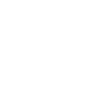

# Adlor · IA — Landing (diseño portable)

Kit **listo para copiar a otro proyecto**. Mismo diseño exacto del mockup de Adlor
(negro, núcleo 3D tipo reactor, lluvia "Matrix" blanca, chrome tipo sistema operativo),
reestructurado como **página principal** editable. Sin dependencias, sin CDN, sin build.

## Estructura

```
adlor-ia-landing/
├── index.html          ← CONTENIDO (edita aquí: textos, secciones, proyectos)
├── css/
│   └── styles.css      ← DISEÑO (colores, tipografías, chrome) — normalmente no se toca
├── js/
│   └── animations.js   ← ANIMACIÓN (Matrix + núcleo 3D + reloj) — no se toca
├── assets/             ← pon aquí tu logo, favicon, imágenes
└── README.md
```

La regla es simple: **el "look" vive en `css/` y `js/`; tú solo editas `index.html`.**

## Cómo verlo

Abre `index.html` con doble clic en el navegador. No necesita servidor.
(Si algún navegador bloquea el CSS/JS por abrir como `file://`, levanta un servidor
local: `npx serve` dentro de la carpeta, o la extensión "Live Server" de VS Code.)

## Cómo cambiar el contenido

Todo está en **`index.html`**, con comentarios `<!-- ... -->` que marcan cada zona:

- **Titular (hero):** el `<div class="eyebrow">`, el `<h1>` y el `<p class="lede">`.
  La palabra en cian se marca con `<em>...</em>`.
- **Botones:** los `<a class="btn">` / `<a class="btn ghost">`. Cambia el texto y el `href`.
- **Métricas del hero:** los cuatro `<div class="kpi">`.
- **Menú y dock:** los enlaces de `.menurow` y `.dockbtn` (arriba y a la izquierda).
- **Contacto:** cambia `hola@adlor.ia` por tu correo real (aparece 2 veces).
- **Barra inferior y pie:** textos de `.osbar` y `footer.foot`.

## Cómo agregar un proyecto

Dentro de `#proyectos`, copia una tarjeta y edítala:

```html
<article class="card"><div class="glow"></div>
  <div class="row1"><div class="face">04</div>
    <div class="who"><div class="name">Nombre</div><div class="role">Categoría</div></div>
    <span class="pill working" style="margin-left:auto"><i></i>En vivo</span></div>
  <p class="act">Descripción con <b>lo importante</b> en negrita.</p>
  <div class="foot"><span class="metric">STACK · <b>Next.js</b></span>
    <a class="metric" href="#" style="color:var(--cyan);text-decoration:none">Ver →</a></div>
</article>
```

La etiqueta de estado (el "pill") tiene 3 variantes: `working` (cian), `wait` (ámbar), `paused` (gris).

## Cómo agregar una sección nueva

1. En el dock, duplica un `<a class="dockbtn" href="#miseccion" data-target="#miseccion">` (con su icono SVG).
2. Añade la sección donde quieras:

```html
<section class="section" id="miseccion" style="margin-top:48px">
  <div class="win-head">
    <span class="win-dots"><i></i><i></i><i></i></span>
    <span class="win-title"><b>Mi sección</b></span>
  </div>
  <div class="grid"> ... tus .card ... </div>
</section>
```

El resaltado automático del dock al hacer scroll funciona solo con que la sección
tenga `class="section"` e `id`, y el botón tenga `data-target="#id"`.

## Poner tu logo

En `index.html`, reemplaza el `<div class="dock-logo">` (y/o el favicon comentado en `<head>`)
por tu imagen:

```html

```

## Cambiar el color de acento

En `css/styles.css`, arriba, cambia `--cyan:#42E6FF;` por tu color. Todo el sitio se actualiza.

## Llevarlo a React / Next.js

El diseño es HTML/CSS/JS puro, así que se porta fácil:

1. Copia `css/styles.css` a tu proyecto (impórtalo en el layout global).
2. Convierte el `<body>` de `index.html` en JSX de un componente/página.
3. Mueve el contenido de `js/animations.js` a un `useEffect(() => { ... }, [])`
   (usa `'use client'` en Next.js). Los `getElementById('matrix'/'core'/...)` funcionan igual
   una vez montado el componente.

## Notas

- 100% autocontenido: no llama a internet, funciona offline.
- Respeta `prefers-reduced-motion`: si el usuario desactiva animaciones, se muestra estático.
- Responsive: en móvil el dock pasa abajo y el núcleo se reduce.
